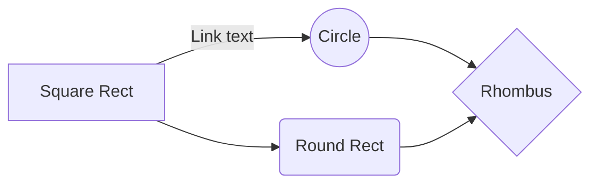

## Billable items

At fortrabbit a payment method may hold one or apps. Each app has one or more environments. With each environment there are multiple components booked. Components are available in different plans.

TODO: Show a graph to highlight this.

* [Invoice anatomy](2.invoice-anatomy.md)

## Pro-rated billing

To support immediate scaling of components, costs are allocated over time and billed at the end of the monthly service period.  The component plans are tiered and thus predictable.

* [Pro rated billing](3.pro-rated-billing.md)

## Billing and collaboration

At fortrabbit a payment method holds the apps. A payment method is an object that has payment credentials attached and receives the invoices. Different people may have access on the payment method to change it and receive invoices.

- Payment method article

## Costs monitoring

The dashboard offer various levels to monitor the hosting costs for the ongoing service period:

- There is an invoice draft for each payment method
- The app overview shows cumulative monthly costs for all it's environments 
- The environment overview shows it's costs
- The component overview with each environments shows a cost break down